# SC24 Deep Learning at Scale Tutorial

This repository contains the example code material for the SC24 tutorial:
*Deep Learning at Scale*.

**Contents**
* [Links](#links)
* [Installation](#installation-and-setup)
* [Model, data, and code overview](#model-data-and-training-code-overview)
* [Single GPU training](#single-gpu-training)
* [Single GPU performance](#single-gpu-performance-profiling-and-optimization)
* [Distributed training with data parallelism](#distributed-training-with-data-parallelism)
* [Multi-GPU model parallelism](#model-parallelism)

## Links

Tutorial slides: https://drive.google.com/drive/folders/1IfHYBBduBOobWEHzeuzoL8zGSKyTGKj9?usp=sharing

Join the Slack workspace: https://join.slack.com/t/nersc-dl-tutorial/shared_invite/zt-2t4ju1dd3-aS6jZ8fJKeJ0PFLsJsomcg

NERSC JupyterHub: https://jupyter.nersc.gov

Data download (only needed if you want to run our examples elsewhere): https://portal.nersc.gov/project/dasrepo/pharring/sc23_data

## Installation and Setup

### Software environment

The instructions in this README are intended to be used with NERSC's Perlmutter machine.

Access to the Perlmutter machine is provided for this tutorial via [jupyter.nersc.gov](https://jupyter.nersc.gov). 
Training account setup instructions will be given during the session. Once you have your provided account credentials, you can log in to Jupyter via the link (leave the OTP field blank when logging into Jupyter).
Once logged into the hub, start a session by clicking the button for Perlmutter Login Node (other options will not work with this tutorial material).
This will open up a session on a Perlmutter login node, from which you can submit jobs to the GPU nodes and monitor their progress.

To begin, start a terminal from JupyterHub and clone this repository with:
```bash
git clone https://github.com/NERSC/sc24-dl-tutorial.git
```
You can use the Jupyter file browser to view and edit source files and scripts. For all of the example commands provided below, make sure you are running them from within the top-level folder of the repository. In your terminal, change to the directory with
```bash
cd sc24-dl-tutorial
```

For running slurm jobs on Perlmutter, we will use training accounts which are provided under the `ntrain4` project. The slurm script `submit_pm.sh` included in the repository is configured to work automatically as is, but if you submit your own custom jobs via `salloc` or `sbatch` you must include the following flags for slurm:
* `-A ntrain4_g` is required for training accounts
* `--reservation=<reservation_name>` is required to access the set of GPU nodes we have reserved for the duration of the tutorial. For the morning  session use `<reservation_name>` set to `sc24_dl_tutorial_1`, and for the afternoon session use `<reservation_name>` set to `sc24_dl_tutorial_2` (we have two different size reservations for the single-GPU and multi-GPU sections respectively)

The code can be run using the `nersc/pytorch:24.06.02` docker container. On Perlmutter, docker containers are run via
[shifter](https://docs.nersc.gov/development/shifter/), and this container is already downloaded and automatically invoked by our job submission scripts. Our container is based on the [NVIDIA NGC 24.06 pytorch container](https://docs.nvidia.com/deeplearning/frameworks/pytorch-release-notes/rel-24-06.html), with a few additional packages added.

### Installing Nsight Systems
In this tutorial, we will be generating profile files using NVIDIA Nsight Systems on the remote systems. In order to open and view these
files on your local computer, you will need to install the Nsight Systems program, which you can download [here](https://developer.nvidia.com/gameworksdownload#?search=nsight%20systems). Select the download option required for your system (e.g. Mac OS host for MacOS, Window Host for Windows, or Linux Host .rpm/.deb/.run for Linux). You may need to sign up and create a login to NVIDIA's developer program if you do not
already have an account to access the download. Proceed to run and install the program using your selected installation method.

## Model, data, and training code overview

The model in this repository is adapted from modern applications of deep learning for weather forecasting, e.g. [FourCastNet](https://arxiv.org/abs/2202.11214), [GraphCast](https://arxiv.org/abs/2212.12794), [Pangu-Weather](https://arxiv.org/abs/2211.02556), and others. These models are trained on a combination of observed and simulated data describing the atmospheric state on Earth over the past several decades, and they achieve impressive performance in terms of accuracy and forecast speed when compared against traditional numerical weather prediction (NWP) models.


For these examples we will be using a [vision transformer](https://arxiv.org/abs/2010.11929) (ViT) architecture, for which our implementation can be found in [`networks/vit.py`](networks/vit.py). ViTs are a widely-used architecture in computer vision, known for scaling well to large datasets and being able to model long-range dependencies easily via the use of self-attention layers. While 'vanilla' ViTs are not necessarily state-of-the-art on the weather forecasting task, they are a good model to use for educational purposes as they are widely used in a variety of applications and the techniques outlined here (e.g. channel-wise tensor parallelism) would transfer well to other applications (e.g. NLP/LLMs).

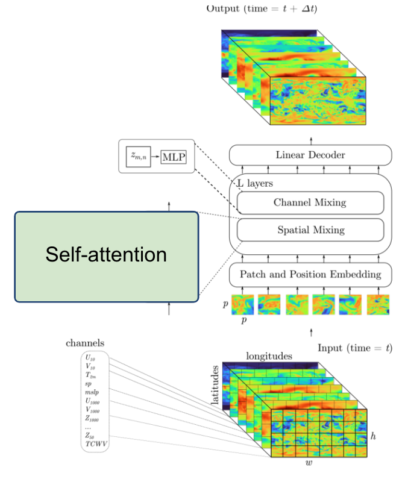

Data-driven weather models are typically trained on the [ERA5 reanalysis dataset](https://www.ecmwf.int/en/forecasts/dataset/ecmwf-reanalysis-v5) from the European Center for Medium-range Weather Forecasts (ECMWF). This dataset represents 40 years of atmospheric data on a 25km global grid, combining simulation outputs assimilated with observations. The basic data loading pipeline for training models is defined in [`utils/data_loader.py`](utils/data_loader.py), whose primary components are:
* The `ERA5Dataset`, which accesses the data stored on disk and serves input-output pairs of the atmospheric variables for training and validation. Each pair is a randomly-sampled snapshots of the atmosphere, separated by a 6 hour timestep. The model is given the first snapshot as input and is trained to predict the snapshot 6 hours later.
* For this repository, we will be using a spatially-downsampled version of the data so training runs a little faster.
* The above dataset object is passed to a PyTorch `DataLoader` which takes the samples and combines them into a batch for each training step.

It is common practice to decay the learning rate according to some schedule as the model trains, so that the optimizer can settle into sharper minima during gradient descent. Here we opt for the cosine learning rate decay schedule, which starts at an intial learning rate and decays continuously throughout training according to a cosine function. This is handled by the `LambdaLR` or `CosineAnnealingLR` utilities from PyTorch, set in [`train.py`](train.py) -- the `LambdaLR` uses custom logic to implement learning rate warm-up if desired for distributed training.

As we will see in the [Single GPU performance profiling and optimization](#Single-GPU-performance-profiling-and-optimization) section, we'll be able to speed up the baseline data loading pipeline significantly by making various improvements. Another option introduced in that section is to do data loading using NVIDIA's DALI library, for which the implementation can be found in [`utils/data_loader_dali.py`](utils/data_loader_dali.py).

The script to train the model is [`train.py`](train.py), which uses the following arguments to load the desired training setup:
```
--yaml_config YAML_CONFIG   path to yaml file containing training configs
--config CONFIG             name of desired config in yaml file
```

Based on the selected configuration, the train script will then:
1.  Set up the data loaders and construct our ViT model, the Adam optimizer, and our L2 loss function.
2.  Loop over training epochs to run the training. See if you can identify the following key components: 
    * Looping over data batches from our data loader.
    * Applying the forward pass of the model and computing the loss function.
    * Calling `backward()` on the loss value to backpropagate gradients. Note the use of the `grad_scaler` will be explained below when enabling mixed precision.
    * Applying the model to the validation dataset and logging training and validation metrics to visualize in TensorBoard (see if you can find where we construct the TensorBoard `SummaryWriter` and where our specific metrics are logged via the `add_scalar` call).

More info on the model and data can be found in the [slides](https://drive.google.com/drive/u/2/folders/1IfHYBBduBOobWEHzeuzoL8zGSKyTGKj9). If you are experimenting with this repository after the tutorial date, you can download the data from here: https://portal.nersc.gov/project/dasrepo/pharring/sc23_data.
Note that you will have to adjust the data path in `submit_pm.sh` to point your personal copy after downloading.

## Single GPU training

First, let us look at the performance of the training script without optimizations on a single GPU.

On Perlmutter for the tutorial, we will be submitting jobs to the batch queue. To submit this job, use the following command:
```
sbatch -n 1 -t 20 ./submit_pm.sh --config=short
```
`submit_pm.sh` is a batch submission script that defines resources to be requested by SLURM as well as the command to run.
Note that any arguments for `train.py`, such as the desired config (`--config`), can be added after `submit_pm.sh` when submitting, and they will be passed to `train.py` properly.
When using batch submission, you can see the job output by viewing the file `vit-era5-<jobid>.out` in the submission
directory. You can find the job id of your job using the command `squeue --me` and looking at the first column of the output.

This will run 128 training iterations on a single GPU using a default batch size of 16.
See [`config/ViT.yaml`](config/ViT.yaml) for specific configuration details.
Note we will use the default batch size for the optimization work in the next section
and will push beyond to larger batch sizes in the distributed training section.

While the model predicts many atmospheric variables, we will focus on the prediction error of surface wind at 10m `u10` to represent model quality.
In the baseline configuration, the model converges to a u10 RMSE of about `0.13` on
the validation dataset in about 22k training iterations. This takes around 22 hours hours to run, so to save time we have already included an example TensorBoard log for the `base` config in the `example_logs` directory for you.
We want to compare our training results against the `base` config baseline, and TensorBoard makes this easy as long as all training runs are stored in the same place. 
To copy the example TensorBoard log to the scratch directory where our training jobs will output their logs, do
```
mkdir -p $SCRATCH/sc24-dl-tutorial/logs
cp -r ./example_logs/base $SCRATCH/sc24-dl-tutorial/logs
```

To view results in TensorBoard, open the [`start_tensorboard.ipynb`](start_tensorboard.ipynb) notebook and follow the instructions in it to launch a TensorBoard session in your browser. Once you have TensorBoard open, you should see a dashboard with data for the loss values, learning rate, and average iterations per second. Looking at the validation loss for the `base` config, you should see the following training curve:


As our training with the `short` config runs, it should also dump the training metrics to the TensorBoard directory, and TensorBoard will parse the data and display it for you. You can hit the refresh button in the upper-right corner of TensorBoard to update the plots with the latest data.

## Single GPU performance profiling and optimization

This is the performance of the baseline script for the first four epochs on a 40GB A100 card with batch size 16 using the `short` config, which limits the number of training and validation samples to 512 and 128 samples respectively:
```
2024-11-08 22:22:33,936 - root - INFO - Starting Training Loop...
2024-11-08 22:23:44,157 - root - INFO - Time taken for epoch 1 is 61.425346 sec, avg 8.335321 samples/sec
2024-11-08 22:23:44,157 - root - INFO -   Avg train loss=0.577775
2024-11-08 22:23:49,532 - root - INFO -   Avg val loss=0.4210963547229767
2024-11-08 22:23:49,532 - root - INFO -   Total validation time: 4.699830055236816 sec
2024-11-08 22:24:44,523 - root - INFO - Time taken for epoch 2 is 54.986979 sec, avg 9.311295 samples/sec
2024-11-08 22:24:44,524 - root - INFO -   Avg train loss=0.391900
2024-11-08 22:24:49,493 - root - INFO -   Avg val loss=0.3769605755805969
2024-11-08 22:24:49,493 - root - INFO -   Total validation time: 4.2772088050842285 sec
2024-11-08 22:25:47,342 - root - INFO - Time taken for epoch 3 is 57.844953 sec, avg 8.851248 samples/sec
2024-11-08 22:25:47,343 - root - INFO -   Avg train loss=0.358102
2024-11-08 22:25:52,339 - root - INFO -   Avg val loss=0.3551669120788574
2024-11-08 22:25:52,339 - root - INFO -   Total validation time: 4.29000997543335 sec
2024-11-08 22:26:50,466 - root - INFO - Time taken for epoch 4 is 58.123552 sec, avg 8.808822 samples/sec
2024-11-08 22:26:50,466 - root - INFO -   Avg train loss=0.345737
2024-11-08 22:26:56,149 - root - INFO -   Avg val loss=0.3510175347328186
2024-11-08 22:26:56,149 - root - INFO -   Total validation time: 5.00057053565979 sec
2024-11-08 22:26:56,155 - root - INFO - DONE ---- rank 0
```
After the first epoch, we see that the throughput achieved is about 8.8 samples/s.

### Profiling with Nsight Systems
#### Adding NVTX ranges and profiler controls
Before generating a profile with Nsight, we can add NVTX ranges to the script to add context to the produced timeline.
We can add some manually defined NVTX ranges to the code using `torch.cuda.nvtx.range_push` and `torch.cuda.nvtx.range_pop`.
We can also add calls to `torch.cuda.profiler.start()` and `torch.cuda.profiler.stop()` to control the duration of the profiling
(e.g., limit profiling to single epoch). You can `grep` through `train.py` for these API calls to see what we've added in this example.

To generate a profile using our scripts on Perlmutter, run the following command: 
```
ENABLE_PROFILING=1 PROFILE_OUTPUT=baseline sbatch -n1 -t 20 submit_pm.sh --config=short
```
This command will run four epochs of the training script, profiling only the last epoch run. It will produce a file `baseline.nsys-rep` that can be opened in the Nsight System's program. The arg `--trace=cuda,nvtx` is optional and is used here to disable OS Runtime tracing for speed. The arg `-c cudaProfilerApi` instructs the profiler to only profile the duration of the runtime between the `torch.cuda.profiler.start()` and `torch.cuda.profiler.stop()` calls.

Loading this profile ([`baseline.nsys-rep`](sample_nsys_profiles/baseline.nsys-rep)) in Nsight Systems will look like this:
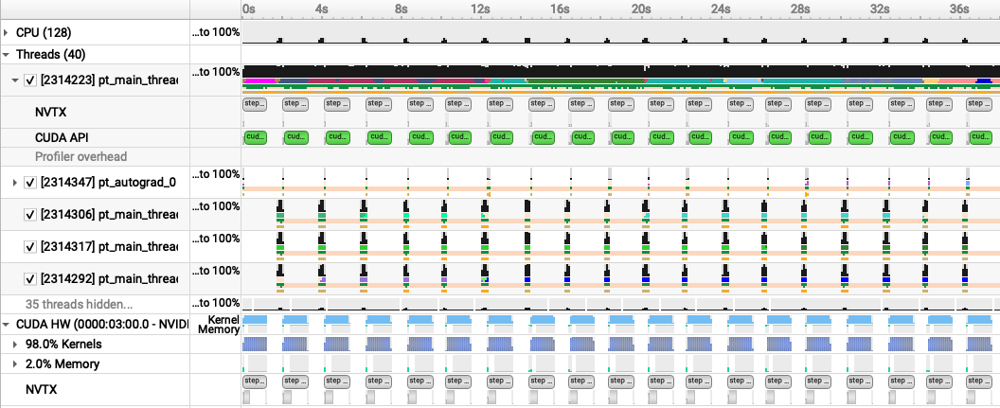

From this zoomed out view, we can see some idle gaps between training iterations. These gaps are due to the data loading, which we will address in the next section.

Beyond this, we can zoom into a single iteration and get an idea of where compute time is being spent:
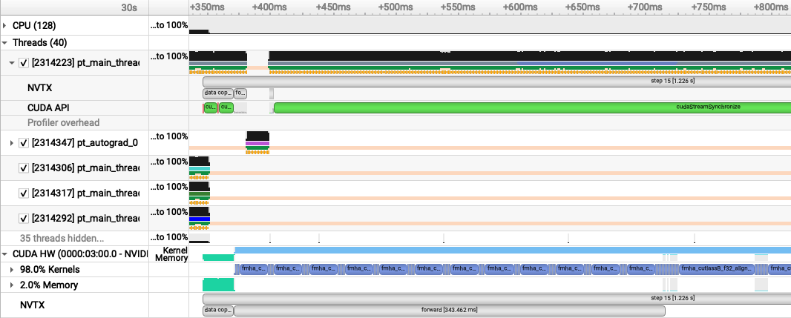


### Data loading optimizations
#### Improving the native PyTorch dataloader performance
The PyTorch dataloader has several knobs we can adjust to improve performance. If you look at the `DataLoader` initialization in
`utils/data_loader.py`, you'll see we've already set several useful options, like `pin_memory` and `persistent_workers`.
`pin_memory` has the data loader read input data into pinned host memory, which typically yields better host-to-device and device-to-host
memcopy bandwidth. `persistent_workers` allows PyTorch to reuse workers between epochs, instead of the default behavior which is to
respawn them. One knob we've left to adjust is the `num_workers` argument, which we can control via the `--num_data_workers` command
line arg to our script. The default used by PyTorch is `num_workers=0`, which runs data loading *sequentially* in the training Python process. This is one source of the large gaps we observed in the first profile. By setting `num_workers>0`, we enable PyTorch to use multiprocessing to perform data loading in a side process to hide this cost. We can experiment with the number of workers to see if performance is improved.

We can run this experiment on Perlmutter by running the following command:
```
sbatch -n 1 -t 20 ./submit_pm.sh --config=short --num_data_workers <value of your choice>
```

This is the performance of the training script for the first four epochs on a 40GB A100 card with batch size 16 and 4 data workers:
```
2024-11-08 22:22:33,935 - root - INFO - Starting Training Loop...
2024-11-08 22:23:25,136 - root - INFO - Time taken for epoch 1 is 41.839162 sec, avg 12.237339 samples/sec
2024-11-08 22:23:25,136 - root - INFO -   Avg train loss=0.578009
2024-11-08 22:23:32,344 - root - INFO -   Avg val loss=0.42334920167922974
2024-11-08 22:23:32,344 - root - INFO -   Total validation time: 6.44074559211731 sec
2024-11-08 22:24:13,287 - root - INFO - Time taken for epoch 2 is 40.937212 sec, avg 12.506958 samples/sec
2024-11-08 22:24:13,287 - root - INFO -   Avg train loss=0.392354
2024-11-08 22:24:18,415 - root - INFO -   Avg val loss=0.3768927752971649
2024-11-08 22:24:18,415 - root - INFO -   Total validation time: 4.4096503257751465 sec
2024-11-08 22:24:59,107 - root - INFO - Time taken for epoch 3 is 40.687515 sec, avg 12.583713 samples/sec
2024-11-08 22:24:59,107 - root - INFO -   Avg train loss=0.358121
2024-11-08 22:25:04,516 - root - INFO -   Avg val loss=0.3551710247993469
2024-11-08 22:25:04,516 - root - INFO -   Total validation time: 4.694499492645264 sec
2024-11-08 22:25:45,206 - root - INFO - Time taken for epoch 4 is 40.685218 sec, avg 12.584423 samples/sec
2024-11-08 22:25:45,206 - root - INFO -   Avg train loss=0.345953
2024-11-08 22:25:50,629 - root - INFO -   Avg val loss=0.3512427508831024
2024-11-08 22:25:50,629 - root - INFO -   Total validation time: 4.708324909210205 sec
2024-11-08 22:25:50,636 - root - INFO - DONE ---- rank 0
```

This is the performance of the training script for the first four epochs on a 40GB A100 card with batch size 16 and 8 data workers:
```
2024-11-08 22:33:04,071 - root - INFO - Starting Training Loop...
2024-11-08 22:34:10,343 - root - INFO - Time taken for epoch 1 is 49.274928 sec, avg 10.390680 samples/sec
2024-11-08 22:34:10,344 - root - INFO -   Avg train loss=0.580136
2024-11-08 22:34:18,993 - root - INFO -   Avg val loss=0.42055439949035645
2024-11-08 22:34:18,994 - root - INFO -   Total validation time: 6.965803146362305 sec
2024-11-08 22:35:01,671 - root - INFO - Time taken for epoch 2 is 42.671460 sec, avg 11.998652 samples/sec
2024-11-08 22:35:01,671 - root - INFO -   Avg train loss=0.389015
2024-11-08 22:35:08,971 - root - INFO -   Avg val loss=0.3716721534729004
2024-11-08 22:35:08,972 - root - INFO -   Total validation time: 6.574234485626221 sec
2024-11-08 22:35:52,249 - root - INFO - Time taken for epoch 3 is 43.268373 sec, avg 11.833123 samples/sec
2024-11-08 22:35:52,249 - root - INFO -   Avg train loss=0.353931
2024-11-08 22:35:59,464 - root - INFO -   Avg val loss=0.3521949052810669
2024-11-08 22:35:59,465 - root - INFO -   Total validation time: 6.2647905349731445 sec
2024-11-08 22:36:41,921 - root - INFO - Time taken for epoch 4 is 42.450545 sec, avg 12.061094 samples/sec
2024-11-08 22:36:41,922 - root - INFO -   Avg train loss=0.342995
2024-11-08 22:36:49,203 - root - INFO -   Avg val loss=0.34849825501441956
2024-11-08 22:36:49,203 - root - INFO -   Total validation time: 6.588480234146118 sec
2024-11-08 22:36:49,216 - root - INFO - DONE ---- rank 0
```

This is the performance of the training script for the first four epochs on a 40GB A100 card with batch size 16 and 16 data workers:
```
2024-11-08 22:32:35,663 - root - INFO - Starting Training Loop...
2024-11-08 22:34:04,500 - root - INFO - Time taken for epoch 1 is 65.897243 sec, avg 7.769672 samples/sec
2024-11-08 22:34:04,724 - root - INFO -   Avg train loss=0.582703
2024-11-08 22:34:15,814 - root - INFO -   Avg val loss=0.4232867658138275
2024-11-08 22:34:15,815 - root - INFO -   Total validation time: 8.690808534622192 sec
2024-11-08 22:35:03,052 - root - INFO - Time taken for epoch 2 is 47.233428 sec, avg 10.839781 samples/sec
2024-11-08 22:35:03,053 - root - INFO -   Avg train loss=0.391875
2024-11-08 22:35:09,827 - root - INFO -   Avg val loss=0.3750896453857422
2024-11-08 22:35:09,827 - root - INFO -   Total validation time: 6.063593864440918 sec
2024-11-08 22:35:57,232 - root - INFO - Time taken for epoch 3 is 47.399871 sec, avg 10.801717 samples/sec
2024-11-08 22:35:57,233 - root - INFO -   Avg train loss=0.356944
2024-11-08 22:36:03,111 - root - INFO -   Avg val loss=0.35426992177963257
2024-11-08 22:36:03,111 - root - INFO -   Total validation time: 5.161340951919556 sec
2024-11-08 22:36:51,289 - root - INFO - Time taken for epoch 4 is 48.173742 sec, avg 10.628197 samples/sec
2024-11-08 22:36:51,291 - root - INFO -   Avg train loss=0.345093
2024-11-08 22:36:59,318 - root - INFO -   Avg val loss=0.35053959488868713
2024-11-08 22:36:59,318 - root - INFO -   Total validation time: 6.992695569992065 sec
2024-11-08 22:36:59,466 - root - INFO - DONE ---- rank 0
```

Increasing the number of workers to 4 improves throughput to around 12.5 samples per second, while increasing to more workers yields a slight degradation in performance.

We can run the 4 worker configuration through profiler using the instructions in the previous section with the added `--num_data_workers`
argument and load that profile in Nsight Systems. This is what this profile ([`4workers.nsys-rep`](sample_nsys_profiles/4workers.nsys-rep)) looks like:
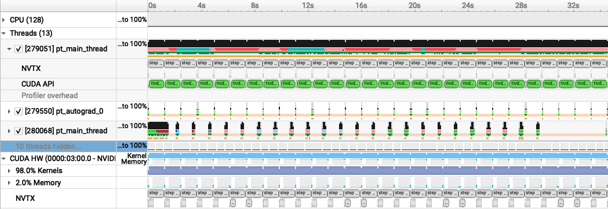

and zoomed in:
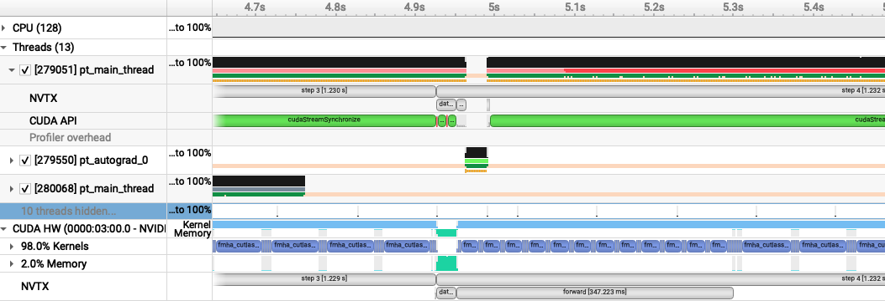

With 4 data workers, the idle gaps between steps are resolved, improving the throughput. Looking at the zoomed in profile, we
still see that the H2D copy in of the input data (i.e. the light green activity at the beginning of the step) takes some time and runs in same CUDA stream as the compute. One option here is to implement a prefetching
mechanism in PyTorch directly using CUDA streams to concurrently load and copy in the next batch of input during the current batch, however
this is left as an exercise outside of this tutorial. A good example of this can be found in [here](https://github.com/NVIDIA/DeepLearningExamples/blob/41f582bd9f65f6ebede77532b7cd64f038a8a380/PyTorch/Classification/ConvNets/image_classification/dataloaders.py#L354)

#### Using NVIDIA DALI
While we were able to get more performance out of the PyTorch native DataLoader, there are several potential overheads we cannot overcome in
PyTorch alone:
1. The PyTorch DataLoader will use CPU operations for all I/O operations as well as data augmentations
2. The PyTorch DataLoader uses multi-processing to spawn data workers, which has performance overheads compared to true threads

The NVIDIA DALI library is a data loading library that can address both of these points:
1. DALI can perform a wide array of data augmentation operations on the GPU, benefitting from acceleration relative to the CPU.
2. DALI maintains its own worker threads in the C++ backend, enabling much more performant threading and concurrent operation.

For this tutorial, we've provided an alternative data loader using DALI to accelerate the data augementations used in this training script that can be found in `utils/data_loader_dali.py`. This data loader is enabled via the command line
argument `--data_loader_config=dali` to the training script.

We can run this experiment on Perlmutter using DALI with 8 worker threads by running the following command:
```
sbatch -n 1 -t 20 ./submit_pm.sh --config=short --num_data_workers 8 --data_loader_config=dali
```

This is the performance of the training script for the first four epochs on a 40GB A100 card with batch size 16 and DALI:
```
2024-11-08 22:37:59,065 - root - INFO - Starting Training Loop...
2024-11-08 22:38:44,454 - root - INFO - Time taken for epoch 1 is 39.402637 sec, avg 12.587990 samples/sec
2024-11-08 22:38:44,455 - root - INFO -   Avg train loss=0.585512
2024-11-08 22:38:48,948 - root - INFO -   Avg val loss=0.4250042140483856
2024-11-08 22:38:48,949 - root - INFO -   Total validation time: 3.4734890460968018 sec
2024-11-08 22:39:27,755 - root - INFO - Time taken for epoch 2 is 38.802052 sec, avg 13.195178 samples/sec
2024-11-08 22:39:27,755 - root - INFO -   Avg train loss=0.394654
2024-11-08 22:39:31,048 - root - INFO -   Avg val loss=0.3783586919307709
2024-11-08 22:39:31,048 - root - INFO -   Total validation time: 2.4079525470733643 sec
2024-11-08 22:40:09,843 - root - INFO - Time taken for epoch 3 is 38.791212 sec, avg 13.198866 samples/sec
2024-11-08 22:40:09,843 - root - INFO -   Avg train loss=0.359940
2024-11-08 22:40:13,064 - root - INFO -   Avg val loss=0.3566215932369232
2024-11-08 22:40:13,065 - root - INFO -   Total validation time: 2.3287765979766846 sec
2024-11-08 22:40:51,877 - root - INFO - Time taken for epoch 4 is 38.809587 sec, avg 13.192617 samples/sec
2024-11-08 22:40:51,878 - root - INFO -   Avg train loss=0.347299
2024-11-08 22:40:55,174 - root - INFO -   Avg val loss=0.35257285833358765
2024-11-08 22:40:55,174 - root - INFO -   Total validation time: 2.403442859649658 sec
2024-11-08 22:40:57,976 - root - INFO - DONE ---- rank 0
```

We can run the DALI case through profiler using the instructions in the earlier section with the added `--data_loader_config=dali`
argument and load that profile in Nsight Systems. This is what this profile ([`dali.nsys-rep`](sample_nsys_profiles/dali.nsys-rep)) looks like:
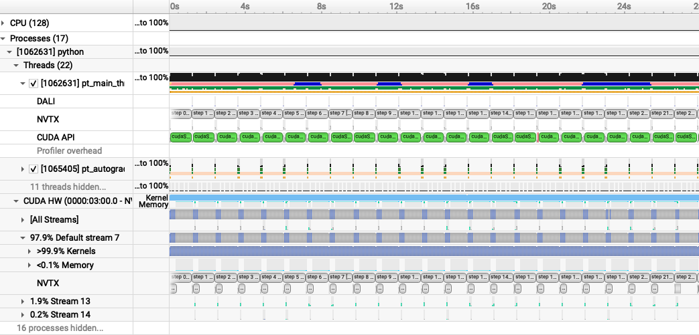

and zoomed in to a single iteration:
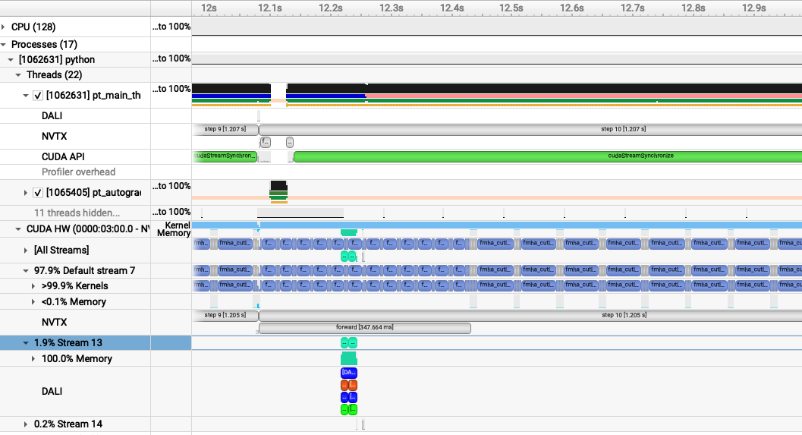

With DALI, you will see that there are now multiple CUDA stream rows in the timeline view, corresponding to internal streams DALI uses
to run data augmentation kernels and any memory movement concurrently with the existing PyTorch compute kernels. Stream 13 in this view shows concurrent H2D memory copies of the batch input data, which is an improvement over the native dataloader.

### Enabling Mixed Precision Training
Now that the data loading performance has been improved, we can start focusing on pushing compute performance. As a first step to improve the compute performance of this training script, we can enable automatic mixed precision (AMP) in PyTorch. AMP provides a simple way for users to convert existing FP32 training scripts to mixed FP32/FP16 of FP32/BF16 precision, unlocking
faster computation with Tensor Cores on NVIDIA GPUs.

The AMP module in torch is composed of two main parts: `torch.cuda.amp.GradScaler` and `torch.cuda.amp.autocast`. `torch.cuda.amp.GradScaler` handles automatic loss scaling to control the range of FP16 gradients when using FP16 precision. Note that since BF16 precision maintains the range of FP32, loss scaling is not required when using AMP with this data type.
The `torch.cuda.amp.autocast` context manager handles converting model operations to BF16/FP16 where appropriate.

As a quick note, the A100 GPUs we've been using to report results thus far have been able to benefit from Tensor Core compute via the use of TF32 precision operations, enabled by default for CUDNN and CUBLAS in PyTorch. We can measure the benefit of TF32 precision usage on the A100 GPU by temporarily disabling it via setting the environment variable `NVIDIA_TF32_OVERRIDE=0`.  
We can run this experiment on Perlmutter by running the following command:
```
NVIDIA_TF32_OVERRIDE=0 sbatch -n 1 -t 20 ./submit_pm.sh --config=short --num_data_workers 8 --data_loader_config=dali
```
yields the following result for 4 epochs:
```
2024-11-08 22:37:54,924 - root - INFO - Starting Training Loop...
2024-11-08 22:38:52,057 - root - INFO - Time taken for epoch 1 is 51.186309 sec, avg 9.690091 samples/sec
2024-11-08 22:38:52,058 - root - INFO -   Avg train loss=0.582846
2024-11-08 22:38:57,213 - root - INFO -   Avg val loss=0.42485159635543823
2024-11-08 22:38:57,213 - root - INFO -   Total validation time: 3.4062464237213135 sec
2024-11-08 22:39:48,037 - root - INFO - Time taken for epoch 2 is 50.818667 sec, avg 10.075038 samples/sec
2024-11-08 22:39:48,038 - root - INFO -   Avg train loss=0.394966
2024-11-08 22:39:52,369 - root - INFO -   Avg val loss=0.3786458373069763
2024-11-08 22:39:52,369 - root - INFO -   Total validation time: 3.182037830352783 sec
2024-11-08 22:40:43,191 - root - INFO - Time taken for epoch 3 is 50.818349 sec, avg 10.075101 samples/sec
2024-11-08 22:40:43,193 - root - INFO -   Avg train loss=0.358938
2024-11-08 22:40:47,524 - root - INFO -   Avg val loss=0.355423241853714
2024-11-08 22:40:47,525 - root - INFO -   Total validation time: 3.195657730102539 sec
2024-11-08 22:41:38,333 - root - INFO - Time taken for epoch 4 is 50.805618 sec, avg 10.077626 samples/sec
2024-11-08 22:41:38,334 - root - INFO -   Avg train loss=0.346205
2024-11-08 22:41:42,673 - root - INFO -   Avg val loss=0.35154277086257935
2024-11-08 22:41:42,674 - root - INFO -   Total validation time: 3.193145751953125 sec
2024-11-08 22:41:45,642 - root - INFO - DONE ---- rank 0
```
From here, we can see that running in FP32 without TF32 acceleration is reduced, hence we are seeing some benefits from
TF32 Tensor Core operations without any code changes to add AMP. With that said, AMP can still provide more performance improvement for A100 GPUs,
as TF32 is a compute type only, leaving all data in full precision FP32. FP16 precision has the compute benefits of Tensor Cores combined with a reduction in storage and memory bandwidth requirements. 

We can run this experiment using AMP on Perlmutter by running one of the following commands:
```
sbatch -n 1 -t 20 ./submit_pm.sh --config=short --num_data_workers 8 --data_loader_config=dali --amp_mode=fp16
```
for AMP with FP16 precision or
```
sbatch -n 1 -t 20 ./submit_pm.sh --config=short --num_data_workers 8 --data_loader_config=dali --amp_mode=bf16
```
for AMP with BF16 precision.

This is the performance of the training script for the first four epochs on a 40GB A100 card with batch size 16, DALI, and AMP FP16:
```
2024-11-08 22:49:25,606 - root - INFO - Starting Training Loop...
2024-11-08 22:49:41,559 - root - INFO - Time taken for epoch 1 is 12.106652 sec, avg 40.969213 samples/sec
2024-11-08 22:49:41,560 - root - INFO -   Avg train loss=0.588574
2024-11-08 22:49:43,521 - root - INFO -   Avg val loss=0.4253874123096466
2024-11-08 22:49:43,522 - root - INFO -   Total validation time: 1.3648040294647217 sec
2024-11-08 22:49:53,089 - root - INFO - Time taken for epoch 2 is 9.562447 sec, avg 53.542780 samples/sec
2024-11-08 22:49:53,090 - root - INFO -   Avg train loss=0.392289
2024-11-08 22:49:54,732 - root - INFO -   Avg val loss=0.3753000795841217
2024-11-08 22:49:54,732 - root - INFO -   Total validation time: 1.146265983581543 sec
2024-11-08 22:50:04,338 - root - INFO - Time taken for epoch 3 is 9.600298 sec, avg 53.331678 samples/sec
2024-11-08 22:50:04,339 - root - INFO -   Avg train loss=0.356447
2024-11-08 22:50:05,949 - root - INFO -   Avg val loss=0.3536761701107025
2024-11-08 22:50:05,950 - root - INFO -   Total validation time: 1.114877462387085 sec
2024-11-08 22:50:15,578 - root - INFO - Time taken for epoch 4 is 9.591419 sec, avg 53.381050 samples/sec
2024-11-08 22:50:15,579 - root - INFO -   Avg train loss=0.344073
2024-11-08 22:50:17,229 - root - INFO -   Avg val loss=0.34965115785598755
2024-11-08 22:50:17,230 - root - INFO -   Total validation time: 1.1637003421783447 sec
2024-11-08 22:50:19,890 - root - INFO - DONE ---- rank 0
```

This is the performance of the training script for the first four epochs on a 40GB A100 card with batch size 16, DALI, and AMP BF16:
```
2024-11-08 22:47:40,862 - root - INFO - Starting Training Loop...
2024-11-08 22:47:53,712 - root - INFO - Time taken for epoch 1 is 10.929039 sec, avg 45.383678 samples/sec
2024-11-08 22:47:53,712 - root - INFO -   Avg train loss=0.583080
2024-11-08 22:47:55,830 - root - INFO -   Avg val loss=0.4219505488872528
2024-11-08 22:47:55,831 - root - INFO -   Total validation time: 1.5665509700775146 sec
2024-11-08 22:48:05,335 - root - INFO - Time taken for epoch 2 is 9.484557 sec, avg 53.982490 samples/sec
2024-11-08 22:48:05,337 - root - INFO -   Avg train loss=0.391346
2024-11-08 22:48:06,721 - root - INFO -   Avg val loss=0.37473177909851074
2024-11-08 22:48:06,722 - root - INFO -   Total validation time: 0.9229915142059326 sec
2024-11-08 22:48:16,257 - root - INFO - Time taken for epoch 3 is 9.529652 sec, avg 53.727041 samples/sec
2024-11-08 22:48:16,258 - root - INFO -   Avg train loss=0.356134
2024-11-08 22:48:17,566 - root - INFO -   Avg val loss=0.35337957739830017
2024-11-08 22:48:17,566 - root - INFO -   Total validation time: 0.8619468212127686 sec
2024-11-08 22:48:27,196 - root - INFO - Time taken for epoch 4 is 9.622881 sec, avg 53.206519 samples/sec
2024-11-08 22:48:27,196 - root - INFO -   Avg train loss=0.343957
2024-11-08 22:48:28,462 - root - INFO -   Avg val loss=0.34935176372528076
2024-11-08 22:48:28,463 - root - INFO -   Total validation time: 0.8311541080474854 sec
2024-11-08 22:48:31,262 - root - INFO - DONE ---- rank 0
```

For this model, we see a massive improvement when using AMP with either FP16 or BF16 precision, improving throughput to over 53 samples/s in each case. BF16 may have a slight edge over FP16 due to the lack of loss scaling.

We can run the case with AMP BF16 enabled through profiler using the instructions in the earlier section with the added `--amp_mode=bf16`
argument and load that profile in Nsight Systems. This is what this profile ([`dali_amp_bf16.nsys-rep`](sample_nsys_profiles/dali_amp_bf16.nsys-rep)) looks like:
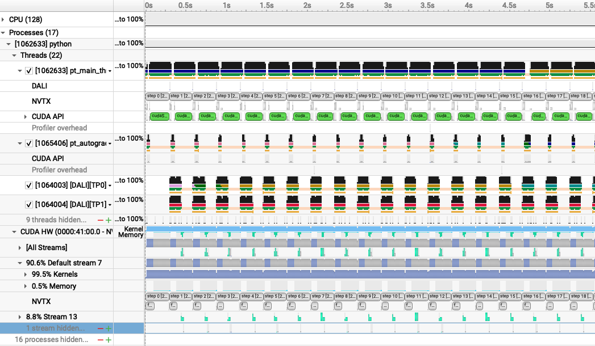

and zoomed in to a single iteration:


With AMP enabled, we see that the `forward` (and, correspondingly the backward) time is significantly reduced. The transformer
architecture we are using relies mainly on GEMM operations that greatly benefit from mixed precision.

### Just-in-time (JIT) compiliation via `torch.compile` and fused optimizers
While AMP provided a large increase in compute speed already, there are a few other optimizations available for PyTorch to improve
compute throughput. A first (and simple change) is to enable the `fused` option in the Adam optimizer from `torch.optim.Adam`.
In the past, this fused optimizer was mainly available in
[APEX](https://github.com/NVIDIA/apex) but has now been made available in PyTorch directly. Enabling the `fused` option resultsin fewer kernels to perform the weight
update than the unfused Adam optimizer, reducing latency and making more efficient use of GPU bandwidth by increasing register
reuse. We can enabled the use of the fused optimizer in our training script by adding the flag `--enable_fused`. 

We can run this experiment using the fused optimizer on Perlmutter by running the following command:
```
sbatch -n 1 -t 20 ./submit_pm.sh --config=short --num_data_workers 8 --data_loader_config=dali --amp_mode=bf16 --enable_fused
```

This is the performance of the training script for the first four epochs on a 40GB A100 card with batch size 16, DALI, and AMP, and the fused optimizer:
```
2024-11-08 22:58:04,258 - root - INFO - Starting Training Loop...
2024-11-08 22:58:22,345 - root - INFO - Time taken for epoch 1 is 11.567046 sec, avg 42.880437 samples/sec
2024-11-08 22:58:22,346 - root - INFO -   Avg train loss=0.582076
2024-11-08 22:58:25,935 - root - INFO -   Avg val loss=0.4246356189250946
2024-11-08 22:58:25,935 - root - INFO -   Total validation time: 2.871800661087036 sec
2024-11-08 22:58:35,542 - root - INFO - Time taken for epoch 2 is 9.598705 sec, avg 53.340527 samples/sec
2024-11-08 22:58:35,543 - root - INFO -   Avg train loss=0.390996
2024-11-08 22:58:37,404 - root - INFO -   Avg val loss=0.37491661310195923
2024-11-08 22:58:37,405 - root - INFO -   Total validation time: 1.291959285736084 sec
2024-11-08 22:58:46,997 - root - INFO - Time taken for epoch 3 is 9.585611 sec, avg 53.413394 samples/sec
2024-11-08 22:58:46,998 - root - INFO -   Avg train loss=0.356147
2024-11-08 22:58:48,816 - root - INFO -   Avg val loss=0.3527429699897766
2024-11-08 22:58:48,817 - root - INFO -   Total validation time: 1.279505729675293 sec
2024-11-08 22:58:58,428 - root - INFO - Time taken for epoch 4 is 9.603735 sec, avg 53.312592 samples/sec
2024-11-08 22:58:58,429 - root - INFO -   Avg train loss=0.343581
2024-11-08 22:59:00,257 - root - INFO -   Avg val loss=0.3488852083683014
2024-11-08 22:59:00,257 - root - INFO -   Total validation time: 1.2782225608825684 sec
2024-11-08 22:59:03,545 - root - INFO - DONE ---- rank 0
```

In additional to optimizer fusion, for more general fusion of operations in PyTorch, we can enable
JIT compilation, done in our training script via the flag `--enable_jit`. This option wraps the model in `torch.compile` which
will compile/fuse eligible operations in the model, further reducing latency.

We can run this experiment using JIT on Perlmutter by running the following command:
```
sbatch -n 1 -t 20 ./submit_pm.sh --config=short --num_data_workers 8 --data_loader_config=dali --amp_mode=bf16 --enable_fused --enable_jit
```

This is the performance of the training script for the first four epochs on a 40GB A100 card with batch size 16, DALI, AMP, fused optimizer and JIT:
```
2024-11-08 22:59:47,489 - root - INFO - Time taken for epoch 1 is 57.044055 sec, avg 8.695034 samples/sec
2024-11-08 22:59:47,490 - root - INFO -   Avg train loss=0.589828
2024-11-08 23:00:03,733 - root - INFO -   Avg val loss=0.4306739866733551
2024-11-08 23:00:03,733 - root - INFO -   Total validation time: 15.653935670852661 sec
2024-11-08 23:00:13,555 - root - INFO - Time taken for epoch 2 is 9.815410 sec, avg 52.162874 samples/sec
2024-11-08 23:00:13,556 - root - INFO -   Avg train loss=0.397297
2024-11-08 23:00:15,268 - root - INFO -   Avg val loss=0.3800353705883026
2024-11-08 23:00:15,269 - root - INFO -   Total validation time: 1.2169783115386963 sec
2024-11-08 23:00:24,935 - root - INFO - Time taken for epoch 3 is 9.656644 sec, avg 53.020490 samples/sec
2024-11-08 23:00:24,936 - root - INFO -   Avg train loss=0.360720
2024-11-08 23:00:26,935 - root - INFO -   Avg val loss=0.356668084859848
2024-11-08 23:00:26,936 - root - INFO -   Total validation time: 1.5062217712402344 sec
2024-11-08 23:00:36,256 - root - INFO - Time taken for epoch 4 is 9.311797 sec, avg 54.984018 samples/sec
2024-11-08 23:00:36,257 - root - INFO -   Avg train loss=0.347498
2024-11-08 23:00:37,927 - root - INFO -   Avg val loss=0.3525484800338745
2024-11-08 23:00:37,928 - root - INFO -   Total validation time: 1.1801795959472656 sec
2024-11-08 23:00:40,127 - root - INFO - DONE ---- rank 0
```

Running a profile ([`dali_amp_bf16_fused_jit.nsys-rep`](sample_nsys_profiles/dali_amp_bf16_fused_jit.nsys-rep)) using these new options and loading in Nsight Systems looks like this:
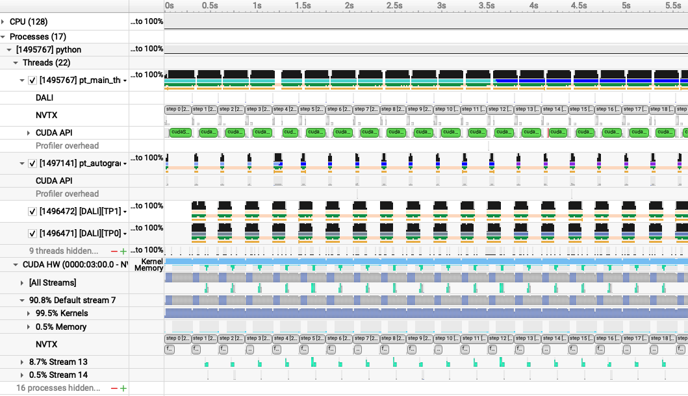

and zoomed in to a single iteration:
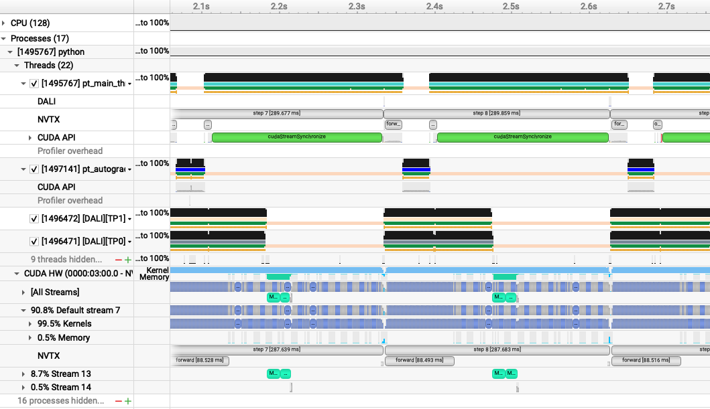

As the compute cost of this model is mostly dominated by large GEMMs, latency reductions via optimizer and pointwise operation fusion are less impactful, but they still provide a small performance boost in this case.

## Distributed training with data parallelism

Instructions for hands-on with mulit-GPU and multi-node training using distributed data parallelism.

Now that we have model training code that is optimized for training on a single GPU,
we are ready to utilize multiple GPUs and multiple nodes to accelerate the workflow
with *distributed training*. We will use the recommended `DistributedDataParallel`
wrapper in PyTorch with the NCCL backend for optimized communication operations on
systems with NVIDIA GPUs. Refer to the PyTorch documentation for additional details
on the distributed package: https://pytorch.org/docs/stable/distributed.html

### Code basics

To submit multi-GPU and multi-node jobs, we can use the same slurm script but specify either
the number of tasks (GPUs) with `-n <number of tasks>` or `-N <number of nodes`. However for 
this session we will be using a different, larger compute reservation, so we have copied
the original submission script to a new one `submit_dp.sh` which will use the larger reservation.

To submit a multi-node, multi-GPU job, you could do, e.g.:
```
sbatch -N NUM_NODES submit_pm_dp.sh [OPTIONS]
```

This script automatically uses the slurm flags `--ntasks-per-node 4`, `--cpus-per-task 32`, `--gpus-per-node 4`, so slurm will allocate all the CPUs and GPUs available on each Perlmutter GPU node, and launch one process for each GPU in the job.

*Question: why do you think we run 1 task (cpu process) per GPU, instead of 1 task per node (each running 4 GPUs)?*

PyTorch `DistributedDataParallel`, or DDP for short, is flexible and can initialize process groups with a variety of methods. For this code, we will use the standard approach of initializing via environment variables, which can be easily read from the slurm environment. Take a look at the `export_DDP_vars.sh` helper script, which is used by our job script to expose for PyTorch DDP the global rank and node-local rank of each process, along with the total number of ranks and the address and port to use for network communication. In the [`train.py`](train.py) script, near the bottom in the main script execution, we set up the distributed backend using these environment variables via `torch.distributed.init_process_group`.

When distributing a batch of samples in DDP training, we must make sure each rank gets a properly-sized subset of the full batch.
*See if you can find where we use the `DistributedSampler` from PyTorch to properly partition the data in [`utils/data_loader.py`](utils/data_loader.py).*

In `train.py`, after our U-Net model is constructed,
we convert it to a distributed data parallel model by wrapping it as:
```
model = DistributedDataParallel(model, device_ids=[local_rank])
```

The DistributedDataParallel (DDP) model wrapper takes care of broadcasting
initial model weights to all workers and performing all-reduce on the gradients
in the training backward pass to properly synchronize and update the model
weights in the distributed setting.

*Question: why does DDP broadcast the initial model weights to all workers? What would happen if it didn't?*

### Scaling and convergence

To speed up training, we try to use larger batch sizes,
spread across more GPUs, with larger learning rates.
Our single-GPU base config from the previous section used a batch size of 16.
So, we will try to keep the local batch size fixed at 16 and scale up the number of GPUs.
In these experiments, we will make use the of the square-root learning rate scaling rule,
which multiplies the base initial learning rate by `sqrt(global_batch_size/base_batch_size)`.
However, the config files will let you set any learning rate you want.
Feel free to experiment with different values and see what happens.

*Question: how do you think the loss curves would change if we didn't increase the learning rate at all as we scale up?*

*Question: what do you think would happen if we simply increased our learning rate without increasing batch size?*

Let's first try running on 4 GPUs on a single node, with a global batch size of 64:
```
sbatch -N 1 submit_pm_dp.sh --config=bs64_opt
```

You can also go ahead and submit jobs that will use 4 nodes and 16 nodes, with respective
batch sizes of 256 and 1024:
```
sbatch -N 4 submit_pm_dp.sh --config=bs256_opt
sbatch -N 16 submit_pm_dp.sh --config=bs1024_opt
```

Look at your new logs in Tensorboard. Compare the speed of training across runs,
as well as the loss and RMSE metrics. You can toggle the horizontol axis to show relative time
to view timing differences.

Quiz questions:

- *As you scale up to more GPUs and larger batch sizes, what speedups do you observe in
  the rate of samples processed? How about in the rate of convergence?*
- *Which config is fastest? Which one is most cost efficient (in terms of total GPU time)?*
- *Try to add a new config with a new batch size and/or an adjusted learning rate.
  Try to predict the outcome. If you run it, do you see what you expect?
  Can you invent a config which overfits, or one which diverges?*

Here is a screenshot of tensorboard showing the RMSE vs relative time for the suggested configs.


## Model parallelism

Now that we are familiar with distributed data parallel training, we are ready to move to more advanced parallelism in the form of model parallelism. One of the main motivations to explore this dimension is the need to use a larger model and/or process higher resolution images: both these can lead to higher accuracies and/or better emulation of physical phenomena. However, they will inflate the memory consumption (activation and weights) as well as computational cost.  At some point, the model (activation and weights) will no longer fit on a single GPU and we need to partition/shard the model across multiple GPUs.

We will increase our model size to motivate this partition and show you the building blocks of implementing model parallelism, motivated by the Megatron-style model parallelism. We will focus mostly on tensor parallelism here, although our implementation also includes [context parallelism](https://docs.nvidia.com/megatron-core/developer-guide/latest/api-guide/context_parallel.html). Our goal is not to build the most efficient model parallel network (which can require significantly more care and development and would parallelize on other dimensions as well) but rather to serve as an instructive blueprint on how to get started on parallelizing your own model in PyTorch. For all the bells and whistles, see [Megatron-LM](https://github.com/NVIDIA/Megatron-LM/tree/main/megatron/core) for deep details.


### Setting up the communicator groups

We typically assume a `MxD` grid of GPUs where we use data parallelism (as before) across D GPUs and split the model across `M` GPUs. Take a look at [`utils/comm.py`](utils/comm.py) where this is setup. The logic is more general where we could split the `M` GPUs into more orthogonal groups (example: `M = M_1 x M_2`) for parallelism on more dimensions.

We will use the same naming convention as Megatron with `dp` referring to data parallelism, `tp` referring to tensor parallelism, `cp` referring to context parallelism (or spatial parallelism in our case) and `pp` for pipeline parallelism. We will implement `dp`, `tp`, and `cp` in our tutorial. These are more relevant to science use-cases with high resolution inputs (and hence more activation memory pressure). Hence, our grid of GPUs is: `total gpus = dp x cp x tp` (setting `pp = 1`). Together, `tp` and `cp` make up our model parallel group (M GPUs, with `M = tp x cp`) and data parallel group is orthogonal to this (D GPUS with `D = dp`)

 
Here's a quick example: Let's say we have 8 GPUs in total and we want to do 4-way tensor parallelism `tp` and 2-way data parallelism `dp`. The logic would simply have the `tp` group (each has 4 GPUs) ranks as `[0, 1, 2, 3], [4, 5, 6, 7]` and `dp` in the orthogonal dimension (each has 2 GPUs) as: `[0, 4], [1, 5], [2, 6], [3, 7]`. So, let's say, we are looking at what work rank `5` is doing -- then, all `tp` communications will happen within the group `[4, 5, 6, 7]` and `dp` gradient reduction across `[1, 5]`.  For this communication, we tell`torch.distributed` about the groups by creating them with `torch.distributed.new_group(ranks = grp)` and for any communication collectives such as `torch.distributed.all_reduce`, we simply pass the group to the [function call (https://pytorch.org/docs/stable/distributed.html#torch.distributed.all_reduce).

Take a look at ['utils/check_rank_generator.ipynb'](utils/check_rank_generator.ipynb) to play around with this communicator group generator. Try assigning different amount of GPUs to each parallelization group. The `order` parameter controls the order of assignment of ranks . Example: order `tp-cp-dp` would keep the `tp` GPUs closest, followed by `cp` and then `dp`. Closer GPUs will be on the same node (usually) and can take advantage of fast bandwidth like NVLink. 

Another thing to note is that we need to only use the `dp` groups for the data loading purposes -- this means that the data for each model parallel group (e.g. `[4, 5, 6, 7]`) should be the same. This is taken care of in [`train_mp.py`](train_mp.py) with the lines:

```
params.data_num_shards = comm.get_size("dp")
params.data_shard_id = comm.get_rank("dp")
```
`get_rank()` and `get_size()` are only within the data parallel group.  

### Setting up the model parallel utilities

Now that we have our groups setup, we just have to tell PyTorch to additionally communicate local results within the groups. All tensor parallel distributed utilities are at [`distributed/`](distributed/). Start off with seeing how the distributed matrix multiply is implemented here [`distributed/layers.py`]. Note that there is a call to `reduce_from_parallel_region()` which does an `all_reduce` of the partial sums. Note that you will need to implement both the forward and backward functions for this new operation that will be used to evaluate and compute the gradient seamlessly. We can do this easily in PyTorch by adding our custom `autograd.Function` class in PyTorch.  This is implemented in [`distributed/mappings.py`](distributed/mappings.py). See the [PyTorch docs](https://pytorch.org/docs/stable/notes/extending.html#how-to-use) for the steps to do this. Check out the `copy_to_parallel_region()` function as well and see the forward and backward operations for them and how they align with what we saw in the slides. Note that we have also implemented other routines (such as gathers and scatters) that are not used for tensor parallel but are used for context parallelism (where we shard the sequence/context dimension across another orthogonal group of GPUs using the `cp` group).

### Running the model parallel code

The train script is at [`train_mp.py`](train_mp.py). The model parallel size is defined by `tp` and `cp`. Let's first focus on just tensor parallelism `tp`. Setting the parameter `tensor_parallel` to `4`, for example, will enable 4-way tensor/model parallelism. Let's run a larger model by increasing our `embed_dim` to `1024` .  The config for this is called `mp` which trains the larger model assuming a global batch size of `64` with 4 GPUs for data parallelism (hence local batch size is `16`) . Let's use no model parallelism: so set `tensor_parallel=1` and run it on 4 GPUs with the following command:

```
sbatch --nodes 1 submit_pm_mp.sh --config=mp --tensor_parallel=1
```

We can see from the logs that the job crashes with an OOM signal because the model is too big.

```
[rank2]: return F.layer_norm(
[rank2]: File "/usr/local/lib/python3.10/dist-packages/torch/nn/functional.py", line 2575, in layer_norm
[rank2]: return torch.layer_norm(input, normalized_shape, weight, bias, eps, torch.backends.cudnn.enabled)
[rank2]: torch.OutOfMemoryError: CUDA out of memory. Tried to allocate 254.00 MiB. GPU 2 has a total capacity of 39.39 GiB of which 217.06 MiB is free. Including non-PyTorch memory, this process has 39.16 GiB memory in use. Of the allocated memory 31.28 GiB is allocated by PyTorch, and 155.23 MiB is reserved by PyTorch but unallocated. If reserved but unallocated memory is large try setting PYTORCH_CUDA_ALLOC_CONF=expandable_segments:True to avoid fragmentation.  See documentation for Memory Management  (https://pytorch.org/docs/stable/notes/cuda.html#environment-variables)
```

If we run it on an 80G GPU, we can see the estimated memory usage to be around 45GB and hence just overflows the 40G GPU. While this example is instructive, larger models (and/or larger inputs) can push the memory consumption significantly higher.

```
2024-11-12 03:19:21,713 - root - INFO - Scaffolding memory high watermark: 10.4781494140625 GB.
2024-11-12 03:19:21,713 - root - INFO - Starting Training Loop...
2024-11-12 03:19:33,484 - root - INFO -  Memory usage after forward pass: 43.8121337890625 GB.
2024-11-12 03:26:17,970 - root - INFO - Time taken for epoch 1 is 408.470099 sec, avg 92.755871 samples/sec
2024-11-12 03:26:17,971 - root - INFO - Avg train loss=0.337123
2024-11-12 03:26:30,450 - root - INFO - Avg val loss=0.2503761947154999
2024-11-12 03:26:30,450 - root - INFO - Total validation time: 11.740140676498413 sec
2024-11-12 03:26:31,303 - root - INFO -  Memory usage after forward pass: 44.9293212890625 GB.
2024-11-12 03:33:17,521 - root - INFO - Time taken for epoch 2 is 406.931129 sec, avg 93.263939 samples/sec
2024-11-12 03:33:17,522 - root - INFO - Avg train loss=0.205674
2024-11-12 03:33:29,642 - root - INFO - Avg val loss=0.17378553748130798
2024-11-12 03:33:29,643 - root - INFO - Total validation time: 11.538096904754639 sec
2024-11-12 03:33:30,357 - root - INFO -  Memory usage after forward pass: 44.92926025390625 GB.
2024-11-12 03:40:17,059 - root - INFO - Time taken for epoch 3 is 407.408527 sec, avg 93.154653 samples/sec
2024-11-12 03:40:17,061 - root - INFO - Avg train loss=0.159756
2024-11-12 03:40:28,331 - root - INFO - Avg val loss=0.14955200254917145
2024-11-12 03:40:28,331 - root - INFO - Total validation time: 10.673660039901733 sec
2024-11-12 03:40:29,132 - root - INFO -  Memory usage after forward pass: 44.92926025390625 GB.
2024-11-12 03:47:16,095 - root - INFO - Time taken for epoch 4 is 407.678463 sec, avg 93.092973 samples/sec
2024-11-12 03:47:16,098 - root - INFO - Avg train loss=0.142359
2024-11-12 03:47:27,502 - root - INFO - Avg val loss=0.13798236846923828
2024-11-12 03:47:27,503 - root - INFO - Total validation time: 10.814826250076294 sec
```


Let's run it with `tensor_parallel=4`, which will partition/shard the hidden dimensions of the MLP weights and biases as well as the attention heads.

Note here that 4 GPUs are used for model parallelism. Recall our global batch size is `64`. How many GPUs do we need? We also want 4-way data parallel, in addition to model parallelism, here: therefore, we should run on 16 GPUs (or 4 nodes on Perlmutter). Remember that we are assuming `tp x dp` GPUs always. Run this config with the command:

```
sbatch --nodes 4 submit_pm_mp.sh --config=mp --tensor_parallel=4
```

```
2024-11-08 12:51:44,863 - root - INFO - Scaffolding memory high watermark: 10.18255615234375 GB.
2024-11-08 12:51:44,863 - root - INFO - Starting Training Loop...
2024-11-08 12:51:55,190 - root - INFO -  Memory usage after forward pass: 31.68060302734375 GB.
2024-11-08 12:56:57,607 - root - INFO - Time taken for epoch 1 is 306.602160 sec, avg 123.573820 samples/sec
2024-11-08 12:56:57,615 - root - INFO - Avg train loss=0.330712
2024-11-08 12:57:08,415 - root - INFO - Avg val loss=0.243482768535614
2024-11-08 12:57:08,415 - root - INFO - Total validation time: 9.684647560119629 sec
2024-11-08 12:57:09,020 - root - INFO -  Memory usage after forward pass: 33.2371826171875 GB.
2024-11-08 13:02:12,319 - root - INFO - Time taken for epoch 2 is 303.860505 sec, avg 124.899417 samples/sec
2024-11-08 13:02:12,321 - root - INFO - Avg train loss=0.202910
2024-11-08 13:02:21,699 - root - INFO - Avg val loss=0.17602449655532837
2024-11-08 13:02:21,700 - root - INFO - Total validation time: 8.193148374557495 sec
2024-11-08 13:02:22,273 - root - INFO -  Memory usage after forward pass: 33.2371826171875 GB.
2024-11-08 13:07:25,039 - root - INFO - Time taken for epoch 3 is 303.334088 sec, avg 125.116172 samples/sec
2024-11-08 13:07:25,040 - root - INFO - Avg train loss=0.160378
2024-11-08 13:07:33,786 - root - INFO - Avg val loss=0.1508728265762329
2024-11-08 13:07:33,786 - root - INFO - Total validation time: 7.953559875488281 sec
2024-11-08 13:07:34,361 - root - INFO -  Memory usage after forward pass: 33.2371826171875 GB.
2024-11-08 13:12:37,045 - root - INFO - Time taken for epoch 4 is 303.251674 sec, avg 125.150175 samples/sec
2024-11-08 13:12:37,045 - root - INFO - Avg train loss=0.142304
2024-11-08 13:12:46,440 - root - INFO - Avg val loss=0.13786984980106354
2024-11-08 13:12:46,440 - root - INFO - Total validation time: 7.972141742706299 sec
```

  

We see that the memory has reduced to 33.2G. Also note that the throughput is higher.

  

We also see that the bigger model gets a better RMSE compared to the batch size `64` run from before (with the smaller model):

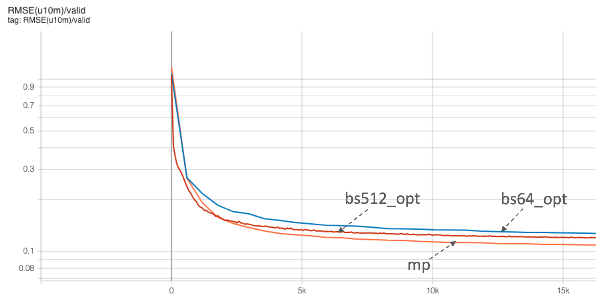

You can try out similar data parallel scaling configs for this model as well. Here's an example screenshot for three different global batch sizes:


  
*Question: Can we drop the memory consumed more? What tensors have we left un-partitioned?*


#### More advanced material with context parallelism (optional)
For high resolution images (common in many scientific problems), it might be more beneficial to shard the sequence (spatial) dimension. We can do this using context parallelism. See the [Megatron-core explanation](https://docs.nvidia.com/megatron-core/developer-guide/latest/api-guide/context_parallel.html) for the communication collectives we need for `cp`. Now we will use `tp x cp x dp` GPUs. For `cp`, the sequence sharding will require additional `allgather` and `reduce-scatter` operations, which we have implemented. Try running:

```
sbatch --nodes 4 submit_pm_mp.sh --config=mp --tensor_parallel=1 --context_parallel=4 --parallel_order=cp-tp-dp
```

Now, we are using just context parallelism (so all model parallel GPUs are used to shard the sequence). Be careful, since this means that the weights are *shared* across the `cp` GPUs.

*Question: If weights are shared across any model parallel GPUs, what considerations should we keep in mind?*
  
 For shared weights, be careful that the weights are properly initialized and if they need additional reductions, then they are implemented through DDP comm hooks.  
To keep track of shared weights, we annotate them (see [this example](https://github.com/NERSC/sc24-dl-tutorial/blob/main/distributed/layers.py#L65-L66)) with:

```
self.weight.is_shared_mp = ['cp'] 
self.weight.mark_for_reduction = ['cp'] 
```
Shared weights need to have the same initialization (see [our implementation here](https://github.com/NERSC/sc24-dl-tutorial/blob/main/distributed/helpers.py#L5-L30)). If the input activation grads are sharded, then the weight gradients for the shared weights need an additional AllReduce. Check out the [comm_hooks](https://github.com/NERSC/sc24-dl-tutorial/blob/ss/readme_changes/distributed/mappings.py#L170-L243), we have implemented to do an additional AllReduce of the weight gradients across the `cp` group. 

**Note:** The right combination of data, tensor, context, and pipeline (if needed) parallelism along with the parallelization order (which group to place on NVLink, for example) requires deep understanding of the sensitivity of the performance to each of these moving parts (as well as the underlying hardware). Typically, engineers build *performance models* to analyze this and discover *optimal* ways to parallelize their model. If you are interested in going deeper and building this intuition, you can check out [performance models for transformers in science](https://arxiv.org/abs/2410.00273).


### Using CUDA Graphs (optional)
In this repository, we have included an alternative training script [train_mp_graphs.py](train_mp_graphs.py) that illustrates applying
PyTorch's new CUDA Graphs functionality to the existing model and training loop. CUDA graphs are useful when trying to minimize
the overhead from launching kernels on the CPU. They can be useful in large scale runs when we have
orthogonal communicators (as here for model parallelism) to avoid jitter from the CPU as well as cases where CPU latency becomes an 
important factor (e.g. models with many small kernel launches). Compare [train_mp.py](train_mp.py) and [train_mp_graphs.py](train_mp_graphs.py) to see
how to use CUDA Graphs in PyTorch.
